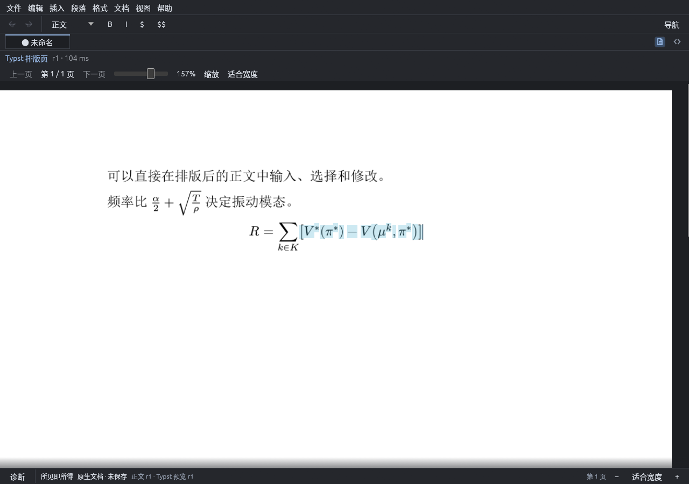
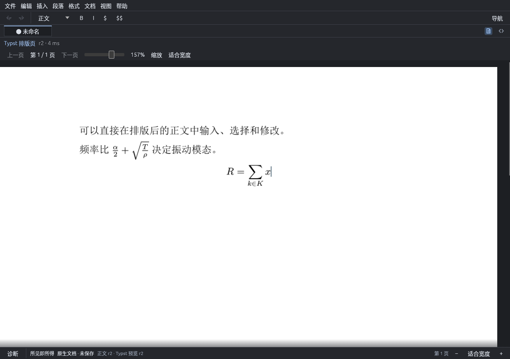
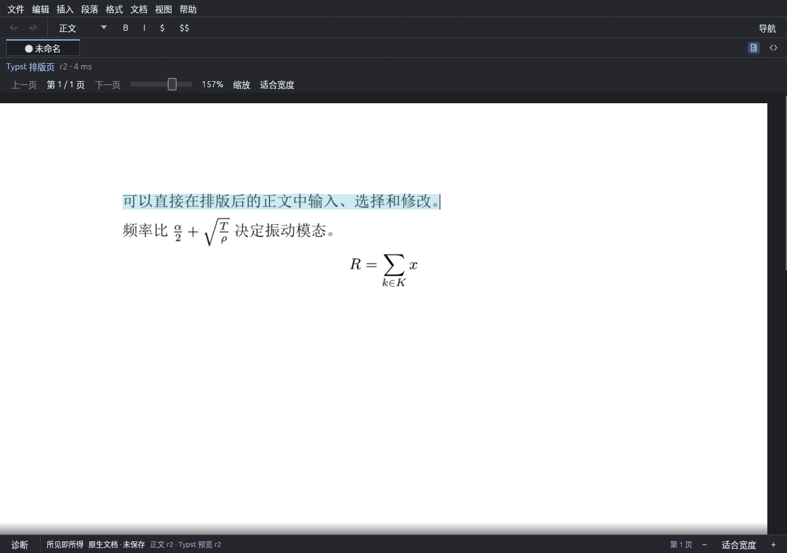

# 2026-09-24：正文与公式直接编辑

用户指出此前“页面 + 下方输入框”误解了所见即所得。此次撤除了独立块输入区，
直接在 Typst 排版后的正文与公式上处理光标、拖选、键盘输入与剪贴板。
没有用普通文本框覆盖公式或整段文字。跨模块边界见 [ADR 0029](../adr/ADR-0029-direct-page-editing.md)。

实际窗口中拖选了 `[V^*(pi^*) - V(mu^k, pi^*)]` 对应的公式字形，复制内容完全一致；
输入 `x` 后该子表达式原位替换，光标落在新字形末尾。中文首段也直接拖选并验证了复制内容。
原始截图、命令与测试日志见[复验目录](../spikes/evidence/SPK-0005/direct-edit/README.md)。

输入按帧形成一个原子范围替换；跨段选择不拆成多个动作。补充了过期页面/不同页码的命中保护、
同帧 IME 防误定位、空槽与隐藏定界符的光标、重排后的滚动/切页、源码定位同步。
被会话拒绝的输入保留供复制，并显示修改未应用。

工作区共 61 项测试通过，格式、clippy、文档 warnings 门禁、文件规模、diff 与依赖许可检查通过；
构建后的原生 X11 窗口复测通过。本轮未将真实平台输入法、读屏或完整数学 TreeCursor 宣称为完成。
公式内部仍基于现有 Math 源串映射，复杂槽位式导航与结构操作属于后续正式数学树接入。
