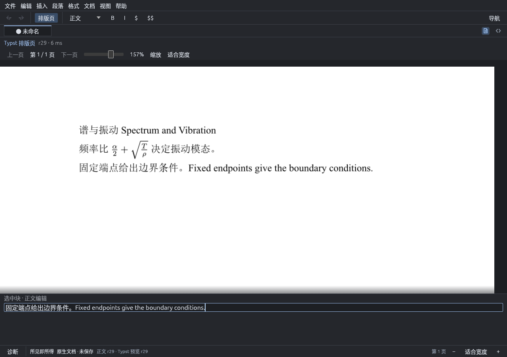
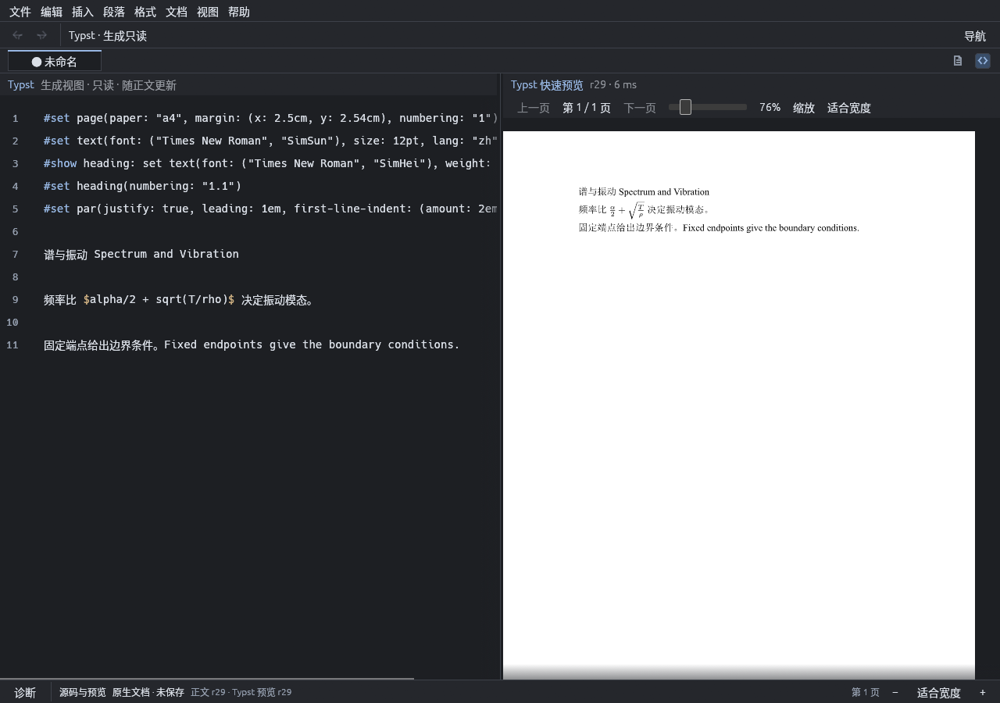
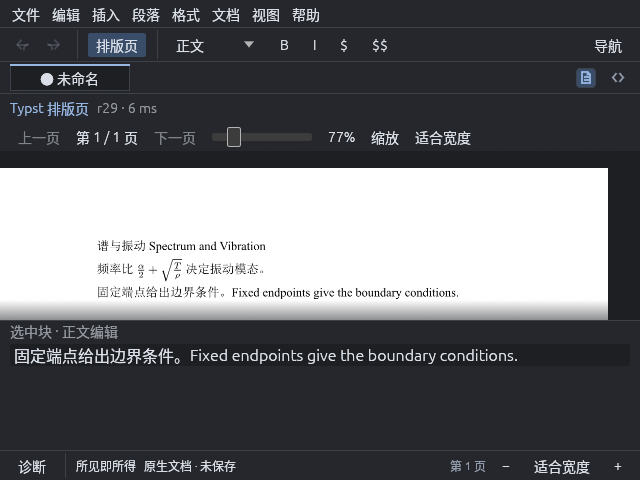
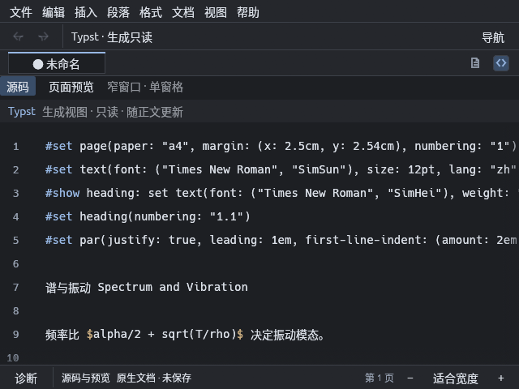
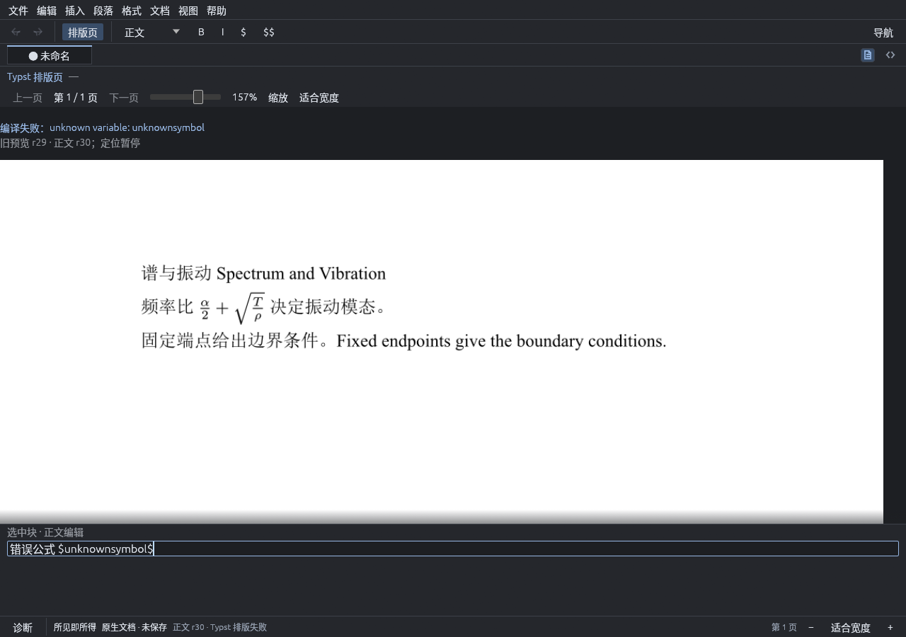

# 2026-09-24：双工作方式 Typst 预览接入记录

本轮收尾 `ation_ciger/feat/preview-workspace` 的未提交预览改动。
设计依据为 [ADR 0027](../adr/ADR-0027-typst-preview-integration.md) 的双工作方式修订，
没有改变阶段出口判定，也没有把块输入框认定为字符级所见即所得。

## 改动与修复

- 可视与源码模式共用后台编译结果；首次空文档去抖后也会主动重绘并编译。
- 仅栅格化选中的页面，同尺寸纹理复用；上限 100 页，超限明确报错。
- 编译及页面事件校验文档身份、revision 和选定页码，拒绝过期结果。
- 源码行可定位到块首页面；页面点击选择块，过期画面暂停定位。
- 原生块输入区固定在下方，保留结构编辑列表切换；缩放复用菜单与快捷键。
- 编译失败保留旧页及其元数据，错误只显示可读诊断，不把内部调试结构暴露给用户。

修复前新增测试复现了三类问题：

1. 旧页面可见时回车分段，再输入 `Second`，结果为 `["First", ""]`。
   输入控件不再依赖过期块锚点后，连续输入通过。
2. 第 10 页显示期间重编译失败，选中页由索引 9 重置为 0。
   失败结果现在保留最后成功页、页数和 revision。
3. 逐字键入 `$alpha/2$`，规范化转义改变了输入框文本与光标，最终未形成 Math 节点。
   按块 ID/revision 保留成功提交的输入拼写后，逐字输入与真实窗口复测通过；
   编译与保存仍只使用 session 的语义快照。

## 验证

- `cargo test --workspace`：52 项通过（app 27、document 9、storage 8、typst 8）。
- `cargo clippy --workspace --all-targets -- -D warnings`、`cargo build -p scholium-app` 通过。
- `cargo fmt --all -- --check`、`RUSTDOCFLAGS='-D warnings' cargo doc --workspace --no-deps` 通过。
- `python3 scripts/check-rust-size.py`、`git diff --check` 通过。
- `cargo deny check licenses bans sources` 通过；保留既有的未遇到 Unicode-DFS-2016 许可白名单提示。
- 后台真实编译覆盖第 10 页按需栅格化、101 页明确拒绝、块首/末锚点和公式排版。
- UI 回归覆盖新建空文档、两种模式去抖、跨文档同 revision 结果拒绝，以及旧 revision/非选定页纹理拒绝。

收尾复跑另发现既有 SIGKILL 测试的竞态：父进程读到 r5 时，子进程可能已完成 r6；
旧断言错误地要求恢复 revision ≤ 5。修正为不得低于已确认提交，并核对正文与动作数均
匹配恢复 revision；未更改存储实现。修正后的定向连续五次与完整 workspace 回归通过。

## 原生窗口复测

在 Linux Xvfb/X11 中运行真实 `target/debug/scholium-app`，使用独立
`SCHOLIUM_SESSION_FILE`，未读取或改写用户会话；`WINIT_X11_SCALE_FACTOR=1`。
以 xdotool 注入按键、xclip 粘贴中文、ImageMagick 截图。步骤：

1. Ctrl+N 新建，在下方输入框粘贴中英文首段，回车分段。
2. 粘贴“频率比 ”，按 25ms 间隔逐字输入 `$alpha/2 + sqrt(T/rho)$`，
   粘贴后半句；再次回车并输入第三段。等待排版后核对公式和正文。
3. Ctrl+2 查看 1280×900 源码/预览等宽视图；缩至 640×480 查看源码与可视模式。
4. 回到 1280×900，在选中块中替换为 `错误公式 $unknownsymbol$`，
   核对编译错误、旧预览 r29 / 正文 r30 提示以及仍可见的输入控件。

这些截图证明的是原生窗口中的块输入、预览及布局。真实桌面 IME/读屏、
字符级排版光标和选区、源码 reconcile、跨平台验收不包含在本轮结论中。

## 同日用户纠正后的替代说明

用户明确否定了上文的“排版页 + 下方块输入框”布局：所见即所得要求直接在排版后的正文与公式上编辑。
上文截图仅保留为被否定方案的历史记录，不作为当前布局验收依据。
后续已撤除该输入区，并接入编译字形驱动的页面光标、选区和输入；见
[页面直接编辑记录](direct-page-edit-review.md)与 [ADR 0029](../adr/ADR-0029-direct-page-editing.md)。
