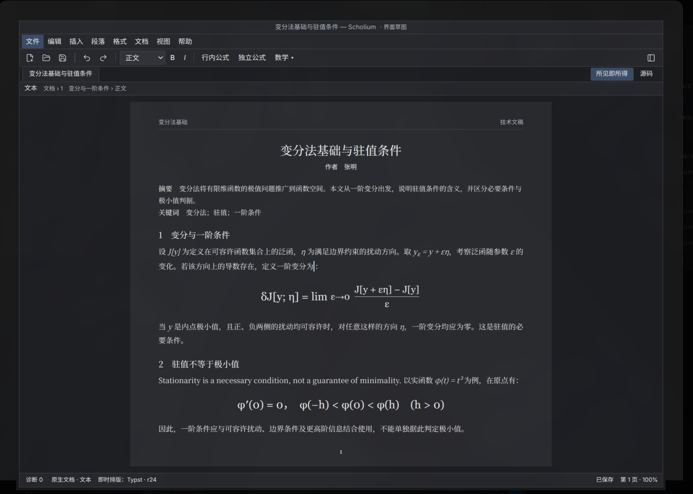
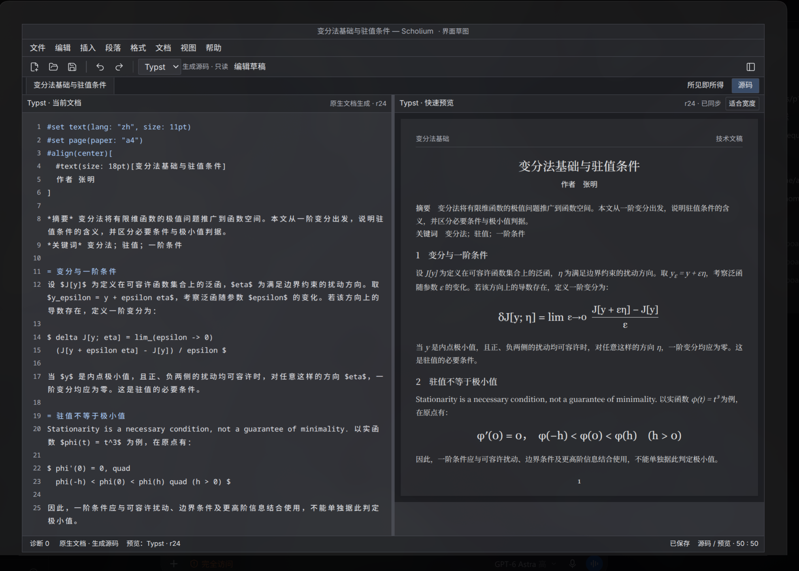

# P1 排版工作区规划

本页规划[阶段 1](ROADMAP.md#阶段-1最小编辑保存与格式交换闭环)的应用壳与编辑入口。
产品定位为科学排版软件，服务论文、书籍、技术文档和研究写作；P1 的基础文本、数学与文件闭环是实现子集，
不能据此把产品收窄成笔记软件。本页作为后续实施与评审的布局基准，不要求逐像素复刻，也不表示对应功能已经实现或通过验收。
正式界面沿用 Rust / egui 原生路线；会话草图仅表达布局与操作关系，不作为应用 UI 技术验证依赖。

## 如何参照执行

开工前先读[体验规范的工作区原则](../EXPERIENCE.md#工作区组织)，再按本页安排布局与操作入口。
原则约束交互关系，参考图帮助理解空间关系，具体控件服从原生平台、可访问性和真实编辑需要。

| 层级 | 执行方式 |
|---|---|
| 必须保持的原则 | 科学排版定位；所见即所得是单一编辑面；源码与预览同等重要；文件操作归属标准菜单；正文优先；权威模型及构建状态不含混 |
| 默认起点 | 源码与预览约 1:1；文件导航和诊断默认收起；常用工具紧凑排列；菜单、快捷键、工具栏调用同一命令 |
| 可自行优化的细节 | 字体、配色、图标、间距、栏高、菜单分组顺序、窗口装饰、缩放策略、窄窗口折叠方式；可因平台和文档类型调整 |
| 不应照搬的示例 | 示例文稿、作者、菜单中尚未交付的能力、人工排版细节、截图的滚动与裁切、草图的占位提示 |

日常细节调整不另设确认门槛：实现者应根据可读性、空间利用、键盘/IME 与无障碍表现作判断。
改变主要区域关系或工作方式时，同一变更先更新对应规范与本页，并在评审说明中给出原因及前后界面对照；
不必为颜色或几像素差异修改整套规划。阶段范围仍由路线图约束，不能因为图上有某个入口就提前扩展 P1。

## 参考图

下列两图来自同一版工作区草图，保存在仓库内，脱离会话也可阅读。它们是当前视口的布局参考，
没有展示的下方正文、状态栏或菜单内容以本页描述为准；不作为产品截图、固定主题或像素验收样本。
图片来源及维护方式见[素材说明](assets/p1-ui/README.md)。

### 所见即所得：页面即编辑面

### 源码：源码与排版结果并重

## 两种工作方式

### 所见即所得

页面中的排版内容就是编辑对象：光标、选区、中文输入、结构数学和焦点都在这里工作。
即时排版直接更新该编辑面，**不在右侧重复显示预览**，也不为独立预览预留空栏。
默认收起文件导航和诊断；页面视口使用工具栏以下、状态栏以上的全部空间。
连续编辑、分页显示与最终排版检查是视图职责，不把排版软件等同于一个带预览的小型笔记页。

正文纸张边距由排版样式决定，工作区外边距保持紧凑。编辑区按缩放与窗口宽度显示内容，
不能靠缩小正文和放大空白来制造“简洁”。当前排版后端和 revision 置于状态栏。
LaTeX 发布目标的最终检查由“文档 → 最终排版检查”按需打开，不占据日常所见即所得布局。

### 源码与预览

主工作区分为左右两个同等重要的窗格：左侧源码，右侧排版结果，默认 **50% / 50%**。
比例按扣除文件导航后的剩余宽度计算；分隔条可拖动、用键盘调整并恢复等宽。
源码窗格显示语言、文件或生成视图来源；预览窗格显示实际后端、revision、同步/过期和构建状态。
预览支持缩放、适合宽度与点击定位，不使用固定 220–300 像素的小型缩略图代替工作预览。

同一文档切换工作方式不改变权威模型：

- 原生项目的源码为生成视图；显式开始编辑后成为独立草稿，检查并应用后才修改正文。
- 外部 `.tex` / `.typ` 项目直接编辑权威源文件；语法错误仍能保存，使用对应原生后端构建。
- 切换可查看的生成方言不等于切换可写语言；有草稿时须先提交、保存或显式处置，再进入另一语言写入。
- 草稿未应用或构建失败时，保留上次成功排版并明确它对应的内容版本，不伪装当前草稿已经生效。

## 区域与空间分配

| 区域 | 布局与职责 |
|---|---|
| 窗口标题 | 文档名、修改标记、应用名；不放打开/保存/导出的强调按钮组 |
| 标准菜单栏 | 文件、编辑、插入、段落、格式、文档、视图、帮助；完整操作入口稳定可查找 |
| 紧凑常用工具栏 | 撤销/重做、段落样式、粗体/强调、基础数学入口；源码模式显示语言和草稿操作。新建/打开/保存归属标准文件菜单，不在工具栏重复排列 |
| 文档标签与工作方式 | 同一行左侧为文档标签区（名称与未保存状态，当前标签高亮，为多文件切换预留）；右侧独立放置所见即所得/源码切换。长标题截断，不挤出右侧切换按钮 |
| 模式与焦点上下文 | 不再单独常驻一行“文本 / 文档 › 名称”。数学等有实际操作意义的焦点上下文按阶段 2 在工具栏按需展示 |
| 主编辑工作区 | 所见即所得为单一编辑面；源码模式为等宽双窗格，二者互斥 |
| 可选辅助面板 | 文件导航由“视图”或工具栏开关展开；诊断由状态栏按需展开；均默认不挤占正文 |
| 底部状态栏 | 当前模式、内容来源、排版后端/revision、保存状态、诊断数量、页码和缩放；保持一行优先 |

桌面草图的尺寸建议：标题约 25、菜单约 29、工具栏约 33、标签行约 32、状态栏约 25 逻辑像素。
这些是初始布局参数，需要在原生字体、DPI、输入法与辅助功能环境下检验；不可牺牲文字或点击目标可用性。
辅助导航展开时建议约 166–220 逻辑像素，并允许调整；源码与预览继续平分余下宽度。
窄桌面窗口优先收起辅助面板。会话草图低于 700 像素时上下排列源码与预览，仅用于窄展示区域阅读；
正式桌面应依据可读字号选择保留分屏或切换单窗格，不能默认把预览缩成缩略图。

## 菜单组织

- **文件**：新建、打开、最近打开、保存、另存为、导出、关闭。打印入口属于整体产品规划，单独确定交付阶段。
- **编辑**：撤销/重做、剪切/复制/粘贴；快捷键、菜单与工具栏使用同一命令。
- **插入**：P1 的行内/独立公式、分数、根式、上下标与定界符；以后扩展图表、引用等文档对象。
- **段落 / 格式**：段落与标题角色、字符样式；文档级规则不混入文件操作。
- **文档**：文档样式、纸张/页边距、语言等整体排版设置的归属，以及最终构建检查入口；能力按阶段开放。
- **视图**：工作方式、文件导航、诊断、缩放与分屏；改变显示不应修改文档内容。
- **帮助**：快捷键、命令说明与应用信息。

导出从文件菜单进入模态流程，不常驻按钮卡片；兼容报告列出降级、阻断、源位置和依赖。
输出锁定 revision，未解决问题阻止正式输出；保存写当前项目，另存为创建独立项目，导出生成副本。
恢复在重新打开异常会话时触发，显示可恢复正文动作与独立草稿，不做成一个日常工作标签。
外部文件冲突按事件触发比较与解决界面，不静默覆盖磁盘内容或本地修改。

## P1 实施边界

草图使用同一篇技术文稿呈现两种工作方式；文稿只采用段落、标题、强调与基础公式作为内容示例。
显示的纸张、页眉和作者用于检验排版工作区的空间关系，并不表示完整模板系统已经交付。
源码与页面是人工布局示意，不能作为两种编译器渲染一致、源码可编辑或 round-trip 通过的证据。

P1 仍以原生编辑、Action/undo、保存重开、强杀恢复、最小 Source Studio、受支持子集源码/PDF 交换为出口。
完整焦点工具栏、结构大纲、复杂文档对象按阶段 2 扩展；完整 source lens、混用和双目标按阶段 3 扩展。
协作、非线性历史等面板依各阶段接入，避免将尚未可用的功能堆到主界面。

所有正文写入产生 Action；草稿单独持久化。编译不阻塞输入、导航或保存；过期映射必须校验后才能定位。
真实焦点、TreeCursor、IME、读屏和键盘操作在原生实现中验收；草图操作不能替代这些门禁。
实施前置继续遵守[阶段 1 接手门禁](../spikes/SPK-0012-exit-criteria.md#阶段-1-接手门禁不继续扩充-p0)。

## 实施与评审检查

每次涉及应用壳或主要布局的变更，按相关项检查；这是布局评审依据，不代替阶段出口与原生编辑验收。

- 默认进入所见即所得后，页面可直接编辑，没有常驻的重复预览或为其留下的空栏。
- 切换源码时，左右窗格初始接近等宽；调整窗口、分隔条或导航栏后，两边仍能完成实际编辑/查看任务。
- 新建、打开、保存、另存为、导出在文件菜单中可找到；常用操作可由工具栏和键盘访问。
- 工具栏和辅助面板服务编辑，不以大按钮、装饰留白、重复状态挤占正文；长文稿滚动不挤走必要操作。
- 切换工作方式不改变权威模型；生成源码、草稿与外部源文件的可写性和保存含义清楚。
- 草稿错误或构建失败仍能保存；旧排版结果明确显示后端、revision 和过期状态。
- 正常与窄窗口、高 DPI、长文档下，控件、公式和输入法候选不被遮挡；键盘与读屏可访问核心操作。
- 交付时提供原生界面的两种模式对照图，说明主要偏离及理由；不以草图截图证明真实编辑能力。

依据：[产品定义](../PRODUCT.md)、[编辑体验](../EXPERIENCE.md)、[应用模块](../modules/app.md)、
[Liii STEM 体验调研](../research/LIIISTEM_EXPERIENCE.md)、[路线图](ROADMAP.md)。

标签栏采用左侧文档标签、右侧工作方式切换的单行组织；早期参考图中的独立上下文行以本节文字为准。
